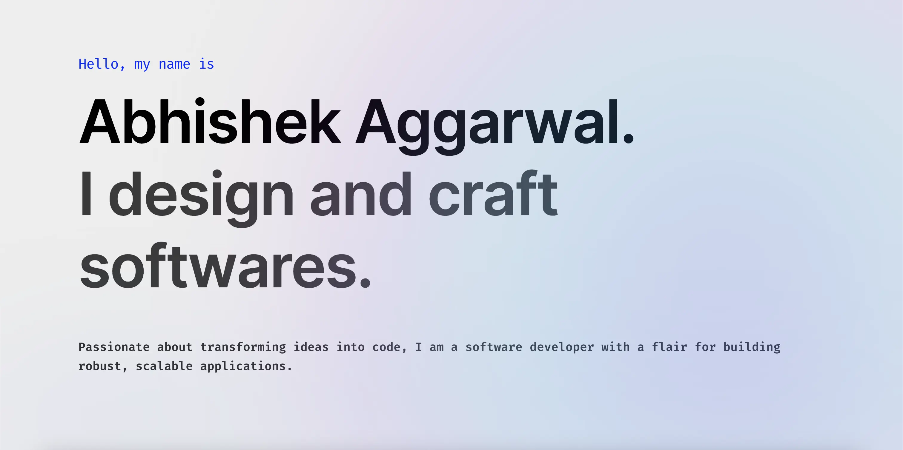

<h2>About Me</h2>

Focused on experience, and driven by engineering, I am a `Software Developer`, with a strong foundation in both design and development, I deeply enjoy solving problems through code. One of my favourite aspects of developing is planning the architecture of a project. From the `system design` all the way to crafting the `front end`, `back end` and the `APIs` in between.

```javascript
const abhishek = {
  pronouns: "he" | "him",

  domains: [
    "Front End Development",
    "Back End Development",
    "API Design and Testing",
    "Development Operations",
    "System Design"
  ],

  expertise: {
    languages:  ["C++", "Python", "JavaScript", "TypeScript"],
    databases:  ["MySQL", "PostgreSQL", "Oracle", "Redis", "MongoDB"],
    frameworks: ["React", "Node.js", "Express", "Next.js", "Tailwind CSS"],
    tools:      ["Git", "Docker", "AWS", "Linux", "Postman"]
  }
}
```

<h2>Repositories</h2>

<p>
  <a href="https://github.com/abhishek-x/web-carbon">
    </a>
  <a href="https://github.com/abhishek-x/TickerTalksAI">
    </a>
  <a href="https://github.com/abhishek-x/learnify">
    </a>
  <a href="https://github.com/abhishek-x/deepfake-lab">
    </a>
  <a href="https://github.com/abhishek-x/exoplanet-detection-keplar-telescope-data">
    </a>
  <a href="https://github.com/abhishek-x/connectly-api">
    </a>
</p>

<h2>Connect with me</h2>
<a style="margin-left: 10px;"  target="_blank" href="https://www.linkedin.com/in/abhishek836/">
  </a>
<a style="margin-left: 10px;" target="_blank" href="https://github.com/abhishek-x">
  </a>
<a style="margin-left: 10px;" target="_blank" href="abhishek.aggarwal836@gmail.com">
  </a>
